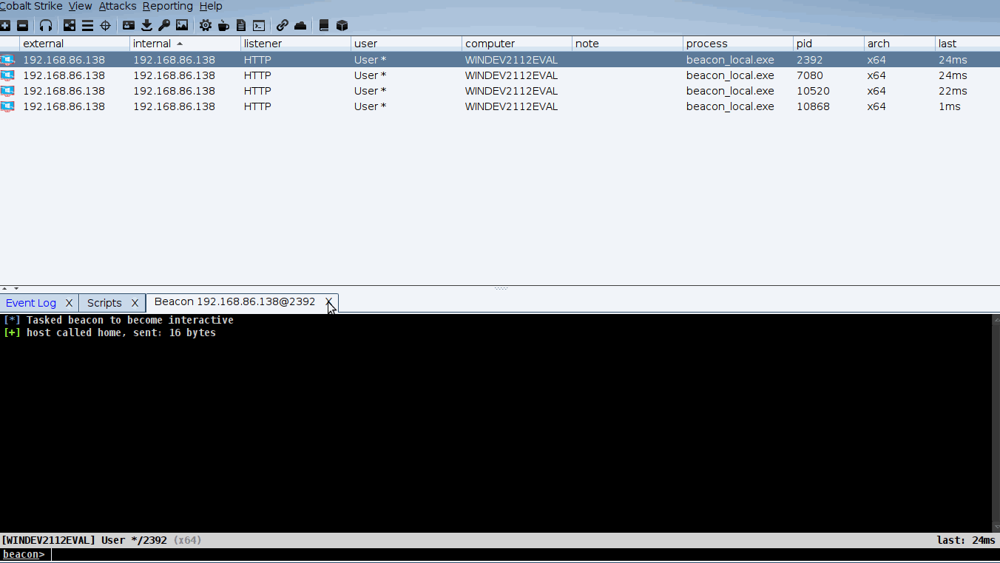

# TabRenamer CNA

## What
- This will allow programmatic renaming of tabs as you see fit, with toggles of your history as you see fit.

## Why
- There needed to be a solution for client-side "configurations" to persist beyond the lifetime of a connection to a `TeamServer`.
- This allows the generation and importing of user-defined `JSON` files, with a code sample to interact with a third-party `JAR` component.
    - As discovered within other repositories, the default method of interacting with `JAR` files in `Sleep` is somewhat broken
    - Large swaths of code are graciously borrowed from [PyCobalt](https://github.com/dcsync/pycobalt) (thank you *very* much!)

## What is this included `JAR` file:
- It is simply the compiled source of [this](https://github.com/stleary/JSON-java/releases/tag/20220320) project's release
    - Instructions on compilation can be found [here](https://github.com/stleary/JSON-java#build-instructions) if you wish to do it yourself.

## Available Commands
| Syntax | Description | Beacon Command Example |
| --- | ----------- | ----------- |
| `cbm` | Set current tab name. | `cbm Kerberoast` | 
| `cbm_hist` | List name history of current tab| `cbm_hist` |
| `rtn` |  Set preferred tab index from `cbm_hist` output | `rtn 1` |
| `dump_json_tabs` | Store all tab metadata into file | `dump_json_tabs` |
| `import_json_tabs` | Import previously-dumped `JSON` tab file | `import_json_tabs /path/to/recovery.json` |

## Example Usage
